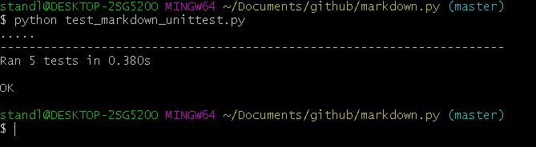

### Part 0
I feel that with my project I would like to follow through with an idea in which I created an app
that can simulate a golf round for the user. While many apps keep track of courses, your handicap, and
other different pats of your game, very few actually show you which holes you struggle with the most,
which is what my app intends to do. I would most likely use a data base of golf courses, if one exists,
and it would be a phone app. The end goal is hopefully to create an app that will help you hone your skills even more. 

### Part 1
Venue:
11 contributors

49398 lines of code in title

First commit was Tuesday December 15, 2015

Last commit was December 11, 2018

Current Branches are: 

origin/HEAD -> origin/dev

origin/ListBranch

origin/better_form_validation

origin/cas_redirect

origin/database-logging

origin/delete

origin/dev

origin/flow-types

origin/frontend-fixes

origin/great-venue

origin/kousuke

origin/list

origin/manual_validation

origin/master

origin/new_dev

origin/pending_icon

origin/return-promise

origin/return-statements

origin/revert-479-database-logging

origin/roles

origin/rpi

origin/security-fixes

origin/sign-up-bug

gitstat file [gitstat_venie](gitstat_venue.PNG)

Inside the file are the different grouce video.

Tornado gource [link to tornado](https://www.youtube.com/watch?v=n5TCfNHC6Rw&feature=youtu.be)

### Part 2

Attached are files for markdown and test_markdown_unittest, as an image showing all 5 tests passing

passing tests 

